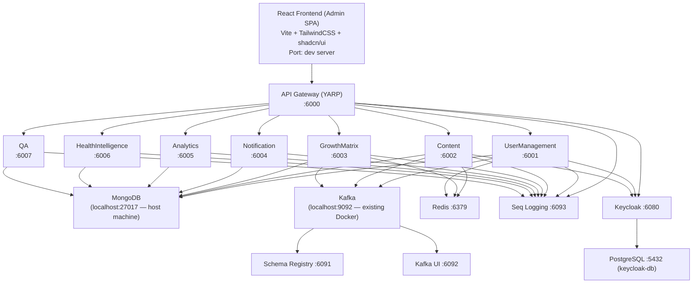

# TipsAndSteps (TNS) — Project Overview

## What is it?
**TipsAndSteps** (خطوات ونصائح) is a bilingual (Arabic/English) platform likely targeted at parents, doctors, and administrators — with features around child growth tracking, health intelligence, content management, Q&A, and analytics.

---

## Architecture



---

## Infrastructure Services (Running in Docker Desktop)

| Container | Image | Port | Purpose |
|-----------|-------|------|---------|
| `keycloak-1` | `quay.io/keycloak/keycloak:24.0` | `6080:8080` | Auth / Identity Provider |
| `keycloak-db-1` | `postgres:16` | internal | Keycloak's database |
| `schema-registry-1` | `confluentinc/cp-schema-registry` | `6091:8081` | Kafka schema management |
| `redis-1` | `redis:7.2-alpine` | `6379:6379` | Caching |
| `seq-1` | `datalust/seq:latest` | `6093:80` | Structured log viewer |
| `kafka-ui-1` | `provectuslabs/kafka-ui:latest` | `6092:8080` | Kafka developer UI |

> **Note:** `seq-1` is currently **Restarting (1)** in Docker Desktop — may need attention.

**Also required (on host machine, not in this compose):**
- **MongoDB** → `localhost:27017`
- **Kafka** → `localhost:9092` (already running in Docker separately)

---

## Backend — .NET Core 8 Microservices

**Location:** `c:\Talks tent\Haya Karema\TipsAndSteps\TNS backend`

### Services

| Service | Port | Swagger | MongoDB DB |
|---------|------|---------|------------|
| **Gateway** (YARP) | `6000` | — | — |
| **UserManagement** | `6001` | `:6001/swagger` | `tips-steps-usermgmt` |
| **Content** | `6002` | `:6002/swagger` | `tips-steps-content` |
| **GrowthMatrix** | `6003` | `:6003/swagger` | `tips-steps-growth` |
| **Notification** | `6004` | `:6004/swagger` | `tips-steps-notification` |
| **Analytics** | `6005` | `:6005/swagger` | `tips-steps-analytics` |
| **HealthIntelligence** | `6006` | `:6006/swagger` | `tips-steps-health-intel` |
| **QA** | `6007` | `:6007/swagger` | `tips-steps-qa` |

### Shared Libraries
- `TipsAndSteps.Shared.Contracts` — Kafka event contracts / DTOs
- `TipsAndSteps.Shared.Infrastructure` — Common infrastructure (Mongo, Redis, Kafka, Keycloak helpers)

### Keycloak Realm
- Realm: `tips-steps`
- Roles: `parent`, `doctor`, `admin`, `superadmin`
- Admin: `admin / admin` at `http://localhost:6080`

---

## Frontend — React (Admin Dashboard SPA)

**Location:** `c:\Talks tent\Haya Karema\TipsAndSteps\TNS frontend`

**Stack:** Vite + React 18 + TypeScript + TailwindCSS + shadcn/ui (Radix UI) + React Query + React Router v6

### Pages / Routes

| Route | Page |
|-------|------|
| `/login` | LoginPage |
| `/` | Dashboard |
| `/users` | UserManagement |
| `/questions` | QuestionsPage |
| `/growth-matrix` | GrowthMatrixPage |
| `/content` | ContentManagement |
| `/analytics` | AnalyticsPage |
| `/health-intelligence` | HeatmapDashboard |
| `/audit-logs` | AuditLogs |
| `/roles` | RolesPermissions |
| `/settings` | SettingsPage |

### Notable Features
- **i18n** (Arabic/English bilingual via `I18nProvider`)
- **RBAC** module (`/src/rbac`)
- **React Query** for API data fetching
- **shadcn/ui** component library

---

## Quick Start

```powershell
# 1. Start infra (already done — Docker Desktop running)
.\start-infra.ps1

# 2. One-time DB + Kafka setup (run once)
.\setup-once.ps1

# 3A. Run all services in Docker
.\start-services.ps1

# 3B. OR run a single service locally (dev mode)
cd src\Services\GrowthMatrix\TipsAndSteps.GrowthMatrix.API
dotnet run

# 4. Frontend
cd "TNS frontend"
npm run dev
```

---

## Things to Watch

- `seq-1` container is **Restarting** — check its logs: `docker logs seq-1`
- MongoDB must be running locally on `localhost:27017` (not Dockerized here)
- Kafka must already be running on `localhost:9092` in Docker
